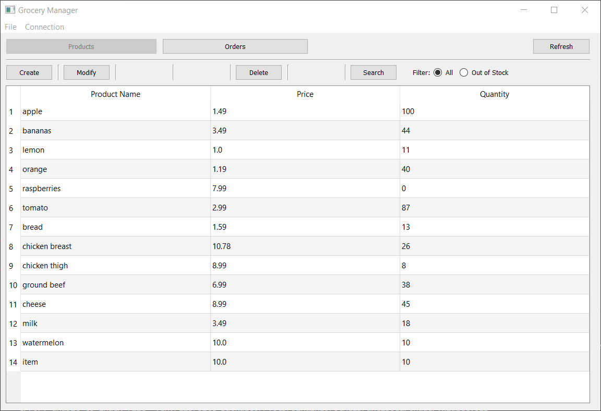
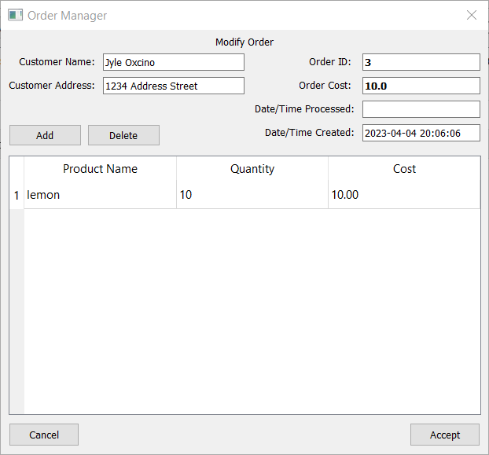

# ACIT-2515 - Flask API App

## About

Grocery Manager Application created using Python and the PyQt5 GUI library.

This application connects to an Flask API endpoint to get data from a database created from SQL Alchemy and the Flask-SQLAlchemy extension.





## Installation

Clone this repository

```
git clone https://github.com/jyleoxcino/ACIT2515_Flask_APP.git
```

## Usage

### Dependencies

This application requires Python 3.11 and some other modules.

Install dependencies using `pip`

```
pip install requests flask flask-sqlalchemy PyQt5
```

### Setup

1. Create and populate database from repo directory using setup.py.

```
python.exe .\setup.py
```

2. Start Flask development web server.

```
python.exe .\webserver.py
```

3. Start Flask_APP in another terminal.

```
python.exe .\GroceryManager.py
```


